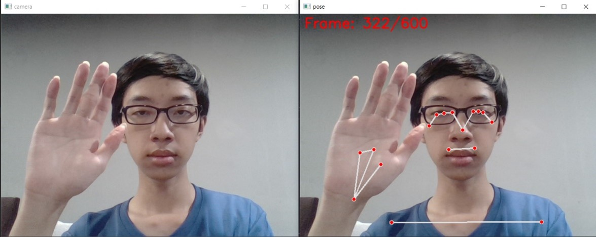
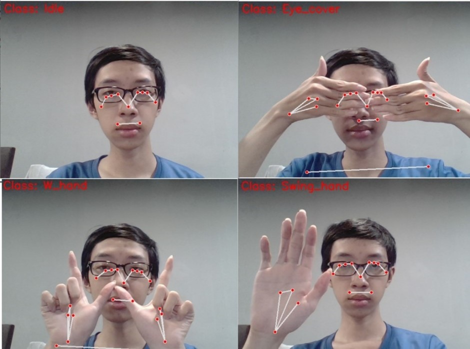

# Behaviour classification

## Introduction
A real-time system to classify single-object behaviour. Using MediaPipe Pose and Tensorflow with LSTM model to not only inference on trained model, but also to train.

## Demonstrate

### Training process


### Inference process


## Folder structure
- The `data` folder includes the generated data from `src/gen_data.py`
- The `src` folder contains source code:
  - `config.py`: 
    - Number of frames will be captured in generating data phase (`N_FRAME`)
    - The delay time (second) before capturing (`N_DELAY`)
    - The configuration of number of epochs (`N_EPOCH`)
    - Batch size (`N_BATCH`)
    - Window size of LSTM layer (`N_TIME`)
  - `gen_data.py`: Used to generate data for different classes
  - `train.py`: The file should be run after generating all the behaviour from `gen_data.py` to create the model
  - `inference.py`: Thereafter, the model is used by this file to inference
- The `models` folder contains the model `best.h5` which were trained by `train.py`

## Architecture

In each frame of picture, I used the `Media Pipe Pose` library from Google to detect poses' landmark. Subsequently, these landmarks were converted as a vector. Each landmark not only contains two coordinates (x, y) but also includes (z, visibility). At the generating data stage, `N_FRAME` video frames were captured after `N_DELAY` second count down. I used a Recurrent neural network (RNN) model which contains LSTM layers and trained it by feeding `N_TIME` window frames continuously. Furthermore, the model also attached some drop-out layers to reduce overfitting.

## Instruction
### Install libraries
```Bash
pip install -r requirements.txt
```

### Generating data

Run the `src/gen_data.py` **for each class**
After starting the script, enter the `class_name` to console

### Training

Run the `src/train.ipynb`

### Inference

Ensure that the trained model is existed `models/best.h5`
Then run the `inference.py`

## Contribution

This project was done by [phuc16102001](https://github.com/phuc16102001/)
You can reference if you needed, but **do not copy** without permission

## Reference

This project was built by referencing and improving the project from [Mi AI](https://www.miai.vn/2022/02/14/nhan-dien-hanh-vi-con-nguoi-bang-mediapipe-pose-va-lstm-model-mi-ai/)
