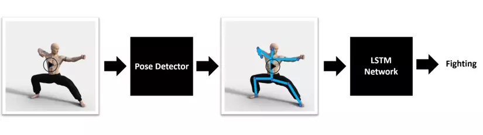

# Behaviour classification

<p>
  
  
</p>

## Introduction

A real-time system to classify single-object behaviour. Using MediaPipe Pose and Tensorflow with LSTM model to not only inference on trained model, but also to train.

## Gallery

<p align="center">
  
</p>
<p align="center">
  <b>Training process</b>
</p>

<p align="center">
  
</p>
<p align="center">
  <b>Inference process</b>
</p>

## Architecture

In each frame of picture, the [MediaPipe Pose](https://google.github.io/mediapipe/solutions/pose.html) library first detect poses' landmark. Each landmark not only contains two coordinates (x, y, z, visibility). Then, these landmarks will be used to train a RNN model which contains LSTM layers. Furthermore, the model also attached some drop-out layers to reduce overfitting.

<p align="center">
  
</p>
<p align="center">
  <b>Model architecture (from <a href="https://aithietke.com/">AI Design</a>)</b>
</p>

## Usage

Firstly, please do install all the required libraries using the command:

```Bash
pip install -r requirements.txt
```

You can either use the pre-trained model in `models/best.h5`, or train a new one by yourself. In this case, the instruction will train a new model.

At the first stage, you need to generate a new dataset. For each class, you need to run the `gen_data.py`:

```bash
python gen_data.py
```

After generating all the classes in `data`, run the `train.py` to train the model:

```bash
python train.py
```

The training process will generate a model in `models/best.h5`. At this moment, you can run the model:

```bash
python inference.py
```

## Contribution

This project was developed by [phuc16102001](https://github.com/phuc16102001/) and referencing from [Mi AI](https://www.miai.vn/2022/02/14/nhan-dien-hanh-vi-con-nguoi-bang-mediapipe-pose-va-lstm-model-mi-ai/).

## License

[MIT](LICENSE)
